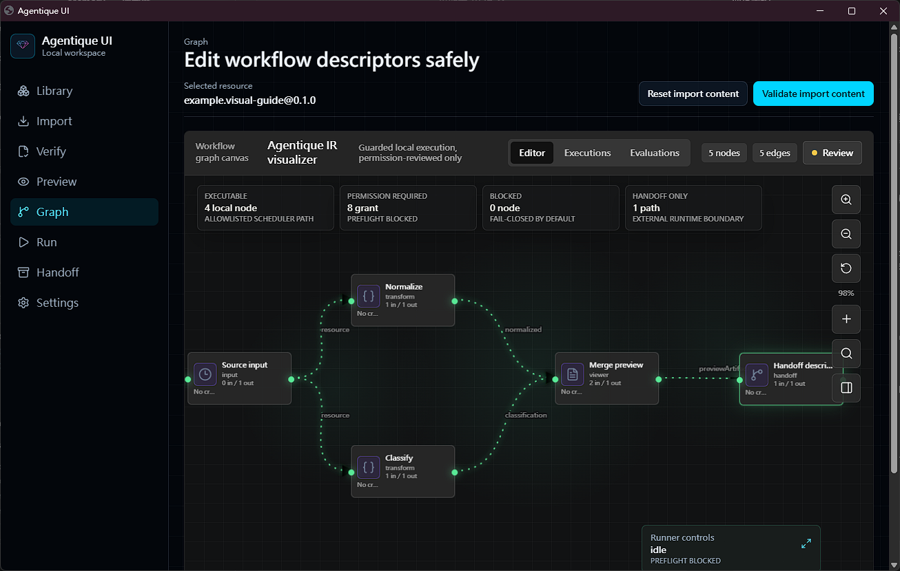

<p align="center">
  
</p>

# Agentique UI

Agentique UI is the local-first desktop workspace for Agentique resources. It helps users import, verify, inspect, preview, run supported local workflows, and hand off resources from [`agentique.io`](https://www.agentique.io) without turning the website into a hosted execution service.

## Contents

- [Highlights](#highlights)
- [Workspace Features](#workspace-features)
- [Localization](#localization)
- [Development](#development)
- [Default App Launch](#default-app-launch)
- [Browser Launch Commands](#browser-launch-commands)
- [Product Boundary](#product-boundary)
- [Release Status](#release-status)
- [Security Boundary](#security-boundary)
- [Docs](#docs)
- [License](#license)

## Highlights

- Source-first local workspace: React/Vite UI with Tauri desktop metadata and app-window launcher support.
- Public-safe import path: untrusted import intents, scoped package verification, local library records, readback-aligned resource identity, and first-class n8n, Dify, and LangGraph format intake.
- Real workflow graph surface: pan/zoom/fit controls, visible nodes and edges, node inspector, validation overlays, unsupported-node reporting, and non-blocking Graph overlays.
- Supported local-run scope: deterministic run-plan review, Permission Center policy diff, Run Dashboard and Queue Monitor, start/cancel/status controls, event timelines, human approval checkpoints with resume/rerun review, run-folder manifests, Logs and Artifact Workbench, cleanup receipts, run history, and signed Python/Node adapter lanes.
- Review-only expansion gates: adapter registry trust policy, repo-local task lane, external agent-client descriptors, MCP bridge readiness descriptors, WASM/WASI sandbox preflight, rootless container preflight, browser automation consent review, local vault references, and descriptor-only diagnostics support bundles.
- Explicit local language choice: Settings can switch app chrome and workspace controls across the initial static catalog without browser-language auto-detection or remote translation services.
- Execution evidence discipline: source-preserving round-trip handoff, release-grade execution validation pack, and secondary workflow format compatibility backlog stay documented without widening runtime claims.
- Companion package alignment: read-only readback badges, no-execution validator proof, safe download acquisition proof, browser-local intake scanning, and review-only uploader previews.
- Release discipline: installer, updater, package, smoke, provenance, rollback, and public-boundary gates remain explicit and fail closed until evidence exists.

## Workspace Features

- **Library** records verified resources, update lifecycle state, and local session evidence without assuming install or execution.
- **Import** parses untrusted intent, validates public metadata, projects companion readback badges, and handles first-class n8n, Dify, and LangGraph samples while keeping unsafe or incomplete inputs blocked.
- **Verify** checks resource bundles, support modes, capability manifests, signatures, companion validator proof, and trust boundaries.
- **Preview** renders safe static previews, companion uploader drafts, and patch previews without loading arbitrary local bytes, submitting uploads, or executing resource code.
- **Graph** visualizes Agentique Workflow IR on a real canvas with fit/zoom/pan, node selection, risk indicators, closeable inspector, accepted run-plan evidence, and minimized Runner controls.
- **Run** exposes the supported-local-only runner path: scoped permission approval, Permission Center policy diff, Run Dashboard and Queue Monitor, start/cancel controls, status readback, event timeline, human approval resume/rerun review, run history, logs, artifacts, and cleanup evidence.
- **Handoff** prepares external runtime, agent-client, MCP readiness, and source-preserving round-trip descriptors without starting bridges automatically.
- **Settings** surfaces release readiness, adapter review, permission policy, multi-lane readiness, vault/redaction posture, diagnostics support-bundle posture, and distribution blockers.

## Localization

Agentique UI includes an explicit Settings language selector for application chrome and workspace controls. English is the default. The initial static catalog covers English, Simplified Chinese, Traditional Chinese, Japanese, Korean, German, French, Italian, Spanish, and Russian.

The selected language is stored locally on the device. The UI does not use browser-language auto-detection, network-loaded catalogs, remote translation services, or a machine-translation runtime.

Imported resource content, workflow data, logs, artifacts, status codes, and evidence values remain user or runtime data. They are not translated by the UI.

## Development

```powershell
npm install
npm run dev:app
npm run validate
```

The app-style local window is the default manual development surface. It starts the Vite server on loopback and opens Agentique UI in a browser app window when the selected browser supports one.

Use the raw Vite server only for automation, screenshot capture, or browser debugging:

```powershell
npm run dev
```

Validation checks contracts, release gates, tests, build output, and public-boundary rules. Public files must not contain private planning markers, local machine paths, credentials, tokens, signing material, or unsupported release claims.

The rebuilt UI regression evidence is recorded in [docs/validation/rebuilt-ui-regression-evidence.md](docs/validation/rebuilt-ui-regression-evidence.md). It covers the local workspace shell, Graph canvas, responsive layout, and supported-local-only/no-overclaim boundary.

Runner capability evidence is recorded in [docs/validation/runner-capability-closeout.md](docs/validation/runner-capability-closeout.md) and [docs/validation/runner-ui-execution-evidence.md](docs/validation/runner-ui-execution-evidence.md).

Execution validation pack and source-preserving handoff evidence are summarized in [docs/validation/runner-ui-execution-evidence.md](docs/validation/runner-ui-execution-evidence.md). Secondary workflow format status is recorded in [docs/compatibility/secondary-workflow-formats.md](docs/compatibility/secondary-workflow-formats.md).

Companion integration evidence is recorded in [docs/contracts/companion-capability-boundary.md](docs/contracts/companion-capability-boundary.md), [docs/contracts/companion-alignment.md](docs/contracts/companion-alignment.md), and [docs/validation/companion-integration-closeout.md](docs/validation/companion-integration-closeout.md).

## Default App Launch

For source-first use without a Tauri desktop build, start the local UI in the default app-style browser window:

```powershell
npm run dev:app
```

If the dev server is already running, open only the app window:

```powershell
npm run open:app
```

This source-checkout path is the standard local app interface. It is still local source use only, not a signed installer, updater, or released desktop product.

## Browser Launch Commands

The launcher accepts `chrome`, `edge`, `brave`, `vivaldi`, `firefox`, and `safari` browser preferences. Chrome, Edge, Brave, and Vivaldi use Chromium app-window mode. Firefox opens a normal browser window fallback unless kiosk mode is requested. Safari is macOS-only and opens a browser-window fallback; Safari Add to Dock remains a manual user action.

Start the dev server and open a preferred browser:

```powershell
# Default discovery order
npm run dev:app

# Chromium app-window browsers
npm run dev:app -- --browser=chrome
npm run dev:app -- --browser=edge
npm run dev:app -- --browser=brave
npm run dev:app -- --browser=vivaldi

# Browser-window fallbacks
npm run dev:app -- --browser=firefox
npm run dev:app -- --browser=firefox --firefox-kiosk
npm run dev:app -- --browser=safari
```

Open a browser window when the dev server is already running:

```powershell
npm run open:app
npm run open:app -- --browser=chrome
npm run open:app -- --browser=edge
npm run open:app -- --browser=brave
npm run open:app -- --browser=vivaldi
npm run open:app -- --browser=firefox
npm run open:app -- --browser=firefox --firefox-kiosk
npm run open:app -- --browser=safari
```

Use `-- --port=<port>` with `npm run dev:app` to start a different local port, or `-- --url=<url>` with `npm run open:app` to open an already running local URL. If no supported browser is available, the script opens the system default browser.

## Product Boundary

Agentique UI is a local workspace for resources and workflow evidence. [`agentique.io`](https://www.agentique.io) remains the platform system of record.

- [`agentique.io`](https://www.agentique.io) owns catalog discovery, upload, scan, review, moderation, publication state, distribution metadata, signatures/checksums, and public readback.
- Agentique UI owns local workspace behavior: import checks, package verification, library records, static preview, workflow graph inspection, supported permission-gated local runs, and export/handoff.
- The current source scope includes React/Vite workspace UI, Tauri desktop metadata, browser app-window launcher, first-class n8n, Dify, and LangGraph intake, static preview, workflow graph canvas, Run, Settings, Permission Center policy diff, Run Dashboard and Queue Monitor, Logs and Artifact Workbench, workflow template and run-plan builder review, adapter registry review, Python/Node adapter evidence, handoff surfaces, source-preserving descriptors, release gates, and public-safe support docs.
- Local runs are limited to `supported-local-only`: the resource must declare the correct support mode, use a signed allowlisted adapter, receive explicit permissions, and produce bounded redacted logs/artifacts plus cleanup evidence.
- The runner is not a general shell, package installer, browser-data bridge, hosted runtime, universal workflow runtime, or production desktop release. Unsupported resources remain inspectable through preview, validation, export, and handoff paths.
- MCP, WASM/WASI, rootless container, and browser automation surfaces are readiness or consent review gates only unless a separate runtime evidence gate accepts execution. They do not start bridges, execute WebAssembly, start containers, pull images, launch browsers, connect browser profiles, or automate external providers.
- Diagnostics support bundle review is descriptor-only. It does not create archives, upload support tickets, collect raw logs, collect raw artifacts, collect browser data, or collect environment snapshots.
- n8n, Dify, and LangGraph are the currently validated first-class workflow import formats. Node-RED, Serverless Workflow, Argo Workflows, Flowise, Langflow, GitHub Actions, Airflow, BPMN, Haystack, Kestra, AutoGen, LlamaIndex Workflows, and CrewAI remain backlog/reference candidates only.
- Companion package semantics are consumed as local evidence only: [`@agentique.io/readback`](https://www.npmjs.com/package/@agentique.io/readback) for read-only projections, [`@agentique.io/validator`](https://www.npmjs.com/package/@agentique.io/validator) for static proof, [`@agentique.io/uploader`](https://www.npmjs.com/package/@agentique.io/uploader) for review-only previews, and [`@agentique.io/action`](https://www.npmjs.com/package/@agentique.io/action) as a CI reference.
- The uploader surface is not a live upload path. It keeps `submissionMode: review-only` and `liveUploadAvailable: false`, exposes no submit/status action, and does not store upload tokens.
- Agentique UI does not yet ship a desktop installer. There is no released installer, signed updater, production desktop runtime, hosted runtime, automatic execution of arbitrary downloaded resources, universal workflow runtime claim, authenticated upload flow, or upload status polling.

## Release Status

Initial publication is source-first: GitHub source, docs, build instructions, and validation evidence can be public before signed installers exist.

Desktop distribution remains evidence-gated. Public installer or updater publication stays No-Go until platform-specific signing, notarization where applicable, updater metadata, checksums, provenance, clean install/update/uninstall smoke, and maintainer review are complete. The final installer/updater release gate therefore still reports `publicationAllowed=false`.

## Security Boundary

The default posture is no execution and no ambient local access. Supported local runs must pass explicit capability, permission, adapter, artifact, and cleanup gates:

- downloaded resources are inspected before any handoff,
- shell execution is blocked by default,
- secrets and environment variables are not forwarded implicitly,
- external runtimes require explicit adapters and support-mode boundaries,
- supported local runs require signed allowlisted adapters and scoped grants,
- Permission Center, Run Dashboard, Logs and Artifact Workbench, local vault references, and diagnostics support bundle surfaces must stay redacted and path-neutral,
- MCP, WASM/WASI, rootless container, and browser automation gates remain review/preflight-only until separate runtime evidence is accepted,
- n8n, Dify, and LangGraph are the only currently validated first-class workflow import formats,
- secondary workflow formats remain backlog/reference only until format-specific gates pass,
- unsupported resources must still show a safe inspect/export/handoff path.

## Docs

- [Install and update](docs/release/install.md)
- [Updater gate](docs/release/updater.md)
- [Smoke tests](docs/release/smoke-tests.md)
- [Troubleshooting](docs/release/troubleshooting.md)
- [Rollback](docs/release/rollback.md)
- [Final readiness](docs/release/final-readiness.md)
- [Rebuilt UI regression evidence](docs/validation/rebuilt-ui-regression-evidence.md)
- [Rebuilt workspace closeout](docs/validation/rebuilt-workspace-closeout.md)
- [Runner capability closeout](docs/validation/runner-capability-closeout.md)
- [Runner UI execution evidence](docs/validation/runner-ui-execution-evidence.md)
- [Function expansion closeout](docs/validation/function-expansion-closeout.md)
- [Runner capability contract](docs/contracts/runner-capability.md)
- [Source-first executable capability contract](docs/contracts/source-first-executable-capability.md)
- [Multi-lane execution readiness](docs/contracts/multi-lane-execution-readiness.md)
- [MCP bridge readiness descriptor](docs/contracts/mcp-bridge-readiness-descriptor.md)
- [WASM/WASI sandbox gate](docs/contracts/wasm-wasi-sandbox-gate.md)
- [Rootless container preflight gate](docs/contracts/rootless-container-preflight-gate.md)
- [Browser automation consent gate](docs/contracts/browser-automation-consent-gate.md)
- [Local vault secrets UX](docs/contracts/local-vault-secrets-ux.md)
- [Diagnostics support bundle](docs/contracts/diagnostics-support-bundle.md)
- [Secondary workflow format backlog](docs/compatibility/secondary-workflow-formats.md)
- [Companion capability boundary](docs/contracts/companion-capability-boundary.md)
- [Companion alignment contract](docs/contracts/companion-alignment.md)
- [Companion integration closeout](docs/validation/companion-integration-closeout.md)
- [Desktop runner validation SOP](docs/security/desktop-runner-sop.md)
- [Security policy](SECURITY.md)
- [Support policy](SUPPORT.md)

## License

Agentique UI is licensed under the [Apache License 2.0](LICENSE).
