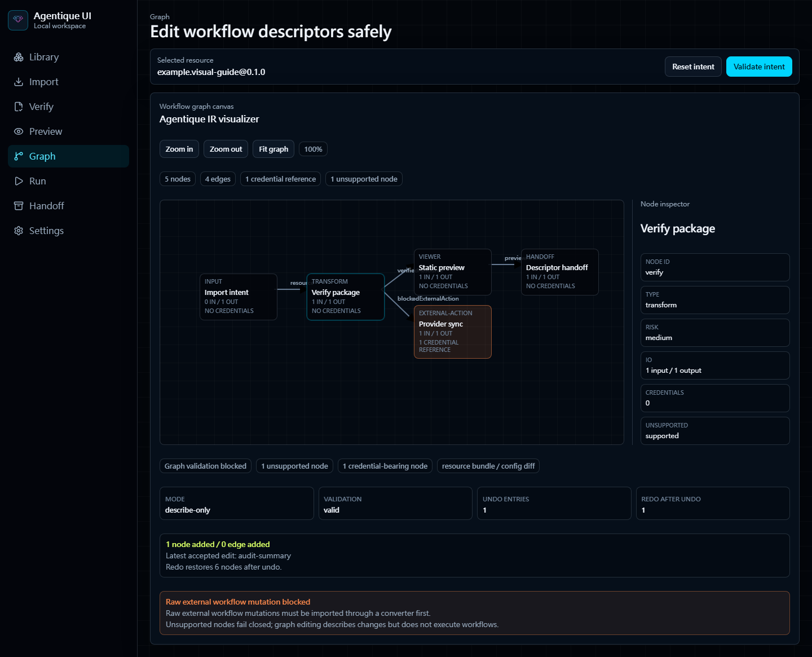
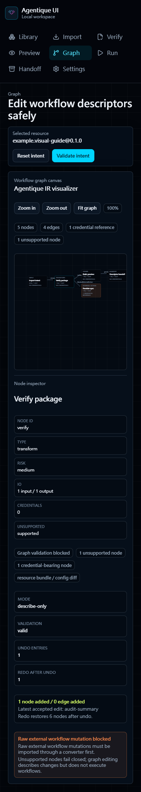

# Rebuilt UI Regression Evidence

Date: 2026-06-12
Scope: Agentique UI rebuilt local workspace shell, Graph canvas, navigation, and responsive layout.

## Captures

Desktop Graph viewport:



Narrow Graph viewport:



## Checks

- The captures open the rebuilt UI directly to the Graph workspace through the public hash route.
- The Graph workspace shows canvas controls, visible nodes, visible edges, node inspector, validation/risk/credential overlays, and supported-local-only guard text.
- The narrow capture verifies the workspace stacks the canvas and inspector without returning to the old static card row.
- Source validation checks page switching, keyboard-accessible buttons, focus-visible styling, reduced-motion CSS, responsive layout, and absence of the old static graph selectors.
- No installer, updater, production desktop runtime, hosted runtime, universal runtime, or automatic arbitrary-resource execution capability is claimed by this evidence.

## Reproduction

Run the local development server on loopback and capture:

```powershell
npm run dev -- --port 5173
npx playwright screenshot --browser=chromium --viewport-size=1440,1000 http://127.0.0.1:5173/#graph docs/validation/artifacts/rebuilt-ui-graph-desktop.png
npx playwright screenshot --browser=chromium --viewport-size=390,920 http://127.0.0.1:5173/#graph docs/validation/artifacts/rebuilt-ui-graph-mobile.png
npm run validate
```
