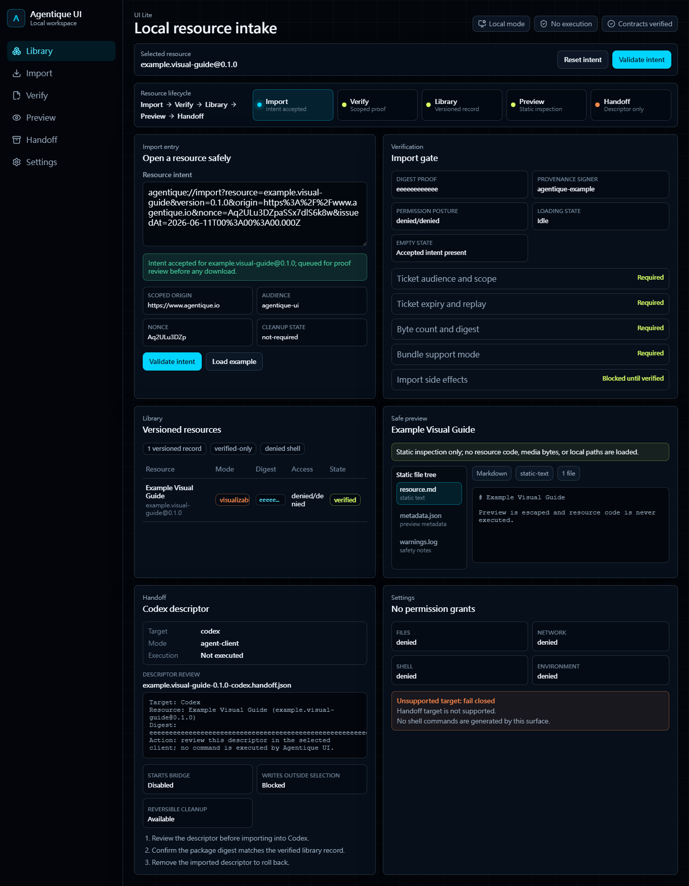
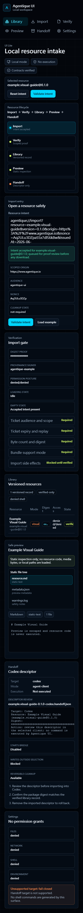

# Visual Regression Evidence

Date: 2026-06-11
Scope: Agentique UI local workspace visual redesign.

## Captures

Desktop viewport:



Mobile viewport:



## Checks

- The captures cover the shell, page navigation, import proof surface, verification surface, library, safe preview, handoff review, and settings posture.
- The mobile capture verifies the layout stacks into a single-column workspace with native controls still visible.
- For the rebuilt Graph canvas evidence, see [docs/validation/rebuilt-ui-regression-evidence.md](rebuilt-ui-regression-evidence.md).
- No installer, updater, production desktop runtime, hosted runtime, universal runtime, or automatic arbitrary-resource execution capability is claimed by this evidence.

## Reproduction

Run the local development server and capture the same route at a desktop viewport and a narrow mobile viewport. Then run:

```powershell
npm run validate
```
